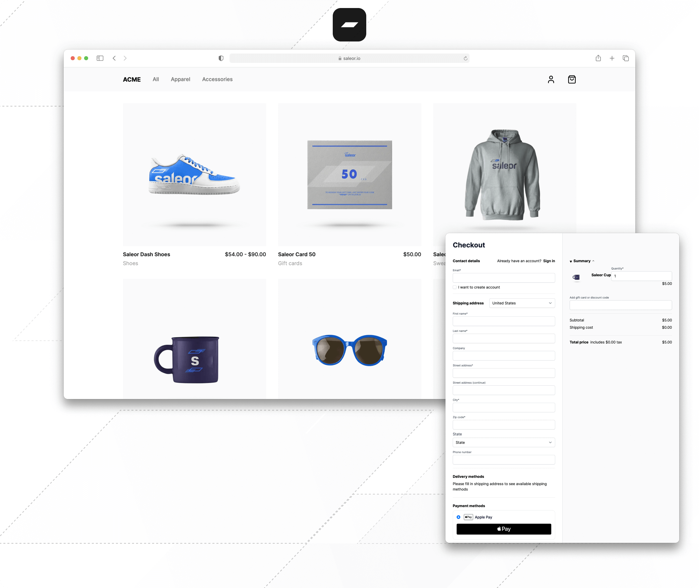

# Hướng Dẫn Chạy Mã Nguồn Saleor Storefront



<div align="center">
  <h1>Saleor Next.js Storefront</h1>
  Gói khởi đầu để xây dựng trải nghiệm thương mại điện tử hiệu quả với <a href="https://github.com/saleor/saleor">Saleor</a>.
</div>

## Hướng Dẫn Cài Đặt và Chạy

### Yêu Cầu Hệ Thống

- Node.js phiên bản 18 trở lên
- PNPM phiên bản 9.4.0 trở lên

### Các Bước Cài Đặt

#### Bước 1: Cài đặt PNPM (nếu chưa có)

```bash
npm install -g pnpm
```

#### Bước 2: Tạo file môi trường

Sao chép file môi trường mẫu sang file môi trường chính:

```bash
copy .env.example .env
```

Mặc định, file `.env` sẽ sử dụng API của Saleor Cloud demo. Bạn có thể giữ nguyên để dùng dữ liệu demo hoặc thay đổi URL API nếu bạn có instance Saleor riêng.

#### Bước 3: Cài đặt các gói phụ thuộc

```bash
pnpm i
```

Quá trình này sẽ cài đặt tất cả các gói phụ thuộc cần thiết cho dự án.

#### Bước 4: Chạy máy chủ phát triển

```bash
pnpm dev
```

Sau khi chạy lệnh này, ứng dụng sẽ khởi động và có thể truy cập tại địa chỉ `http://localhost:3000`.

### Các Tính Năng Chính

- **Giao diện cửa hàng đầy đủ**: Danh mục sản phẩm, chi tiết sản phẩm, giỏ hàng, thanh toán
- **Tài khoản người dùng**: Đăng nhập, đăng ký, quản lý đơn hàng
- **Thanh toán**: Tích hợp Adyen và Stripe
- **Tối ưu hóa SEO**: Metadata và cấu trúc URL thân thiện với SEO

### Cấu Trúc Dự Án

- `/src`: Mã nguồn chính của ứng dụng
- `/public`: Tài nguyên tĩnh
- `/src/gql`: Các truy vấn và biến đổi GraphQL

### Lưu Ý

- Đây là ứng dụng Next.js sử dụng App Router. Nếu bạn chưa quen với Next.js, hãy tham khảo [tài liệu Next.js](https://nextjs.org/docs) (chọn "Using App Router" trong thanh bên).
- Nếu bạn thay đổi hoặc tạo mới các truy vấn GraphQL trong thư mục `gql`, hãy chạy lệnh sau để tạo lại các types:

```bash
pnpm run generate
```

### Chế Độ Xem Trước (Draft Mode)

Truy cập `http://localhost:3000/api/draft` để bật cookie vô hiệu hóa bộ nhớ đệm và xem trước các thay đổi danh mục và nội dung ngay lập tức.
